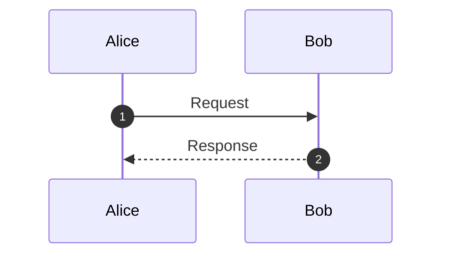

# Astucia Wiki

A flat-file, self-hosted wiki for teams. No database required — all content is stored as plain files on disk.

## What it is

Astucia Wiki combines several content types in one place:

- **Markdown pages** — rich editor with inline and classic modes, keyboard shortcuts, `{include:ID}` transclusion, and live preview
- **Diagrams** — embedded draw.io editor with automatic SVG preview generation
- **Structured lists** — spreadsheet-style tables with typed columns, named views, filters, and CSV/XML/JSON export
- **Team chat** — per-file chat threads with real-time polling, emoji reactions, pinned messages, and #mentions
- **AI assistants** — per-space AI users (Claude, GPT, or any OpenAI-compatible model) that respond to #mentions in chat and can read and write wiki pages
- **AI agent jobs** — scheduled or on-demand jobs that run an AI user against a prompt and optionally write the result to a wiki page, plus one-off `/aiJob` requests queued from the chat prompt for long, reasoning-heavy work that answers back in the thread when it finishes
- **MCP server** — exposes the wiki's tools over the Model Context Protocol so external AI agents and MCP clients can list, search, read, write, tag, and traverse related pages
- **Knowledge graph** — interactive graph of how pages connect, combining explicit `pageid` links, folder hierarchy (parent/child/sibling pages), and shared tags; view the whole space or focus on one page's neighbourhood, with backlinks and related-page discovery
- **File attachments** — drag-and-drop upload stored per-page, plus dedicated file-library folders
- **Full-text search** — keyword search and tag cloud across all content; optional SQLite FTS5 engine adds relevance ranking, highlighted snippets, prefix matching, and cross-space search; an advanced search builder saves reusable queries as pages
- **Page chat** — each Markdown page can have its own chat thread alongside the content
- **Navigation & discovery** — file tree and folder-browse panes, per-page table of contents, backlinks, and "my mentions" / "my comments" views
- **Page sharing** — email a link to any page (when email is configured)
- **Daily updates** — opt-in daily digest email summarising pages created or updated in the last 24 hours across the spaces you can access
- **Mobile support** — responsive layout with a dedicated mobile Markdown editor and compact toolbar; switch between desktop and mobile views from the sidebar
- **Spaces** — isolated workspaces for different teams or projects, with per-user access control
- **Personalization** — per-user preferences (font, font size) and a saved/favourite pages list
- **Localization** — UI available in English, Danish, Swedish, Spanish, French, and German; users pick their language from the sidebar
- **Git integration** — optional version history per file; pages and diagrams auto-commit on save, chats and lists support manual snapshots

Authentication is optional. When enabled it uses OIDC (tested with Auth0) with three roles: admin, editor, and reader.

## Quick start

```bash
git clone https://github.com/madsrg/astucia-wiki.git
cd astucia-wiki
composer install
cp config.php.txt config.php   # edit config.php before starting
php -S localhost:8000
```

Open `http://localhost:8000`. No database, no build step.

### Docker

```bash
docker build -t astucia-wiki:local .
cp docker/wiki.env.example /srv/astucia-wiki/wiki.env   # edit it
./docker/create_container.sh
```

One container (nginx + PHP-FPM + cron), with all pages, settings and logs on the host so
a backup is a `tar` of one directory and deleting the container loses nothing.
**[DOCKER.md](DOCKER.md)** covers configuration, management, cron, backup/restore, and
putting it behind nginx with Let's Encrypt.

### Configuration

`config.php.txt` is a template committed to the repository. Copy it to `config.php` and fill in your values before first use. Because `config.php` is excluded from version control, running `git pull` to update the wiki will never overwrite your live configuration.

The minimum required settings are `PAGES_DIR` (where wiki content is stored) and `APP_TITLE`. Everything else — authentication, email, logging — is optional and disabled by default.

## Authentication

Authentication is optional and off by default. `AUTHENTICATION` in `config.php` selects the method:

| Value | Behaviour |
|---|---|
| `'off'` | No authentication — every visitor has full admin access (the default) |
| `'oidc'` | OIDC / OAuth2 only (tested with Auth0, Keycloak, Okta) |
| `'otp'` | One-time codes by email; users are added manually to `users.json` |
| `'both'` | OIDC and OTP side by side; each user record carries an `auth` field |

For `'oidc'` or `'both'`, also set the four OIDC constants (`OIDC_PROVIDER_URL`, `OIDC_CLIENT_ID`, `OIDC_CLIENT_SECRET`, `OIDC_REDIRECT_URI`). `AUTHENTICATION_ENABLED` still exists as a legacy shim, but it is derived from `AUTHENTICATION` — don't set it by hand.

### Bootstrapping the first admin

Because you have server-side access during setup, the easiest way to create the first admin account is:

1. Enable authentication and open the wiki in a browser.
2. Log in with your identity provider. You will land on an *"Access pending"* page — that is expected. The wiki has written your OIDC `sub`, name, and email into `user_requests.json` on the server.
3. On the server, open `user_requests.json` and find your entry. Copy the `sub`, `name`, and `email` into `users.json` (create it if it doesn't exist), add `"role": "admin"` and `"spaces": null`:

```json
{
  "users": [
    {
      "sub":    "<paste sub from user_requests.json>",
      "name":   "Your Name",
      "email":  "you@example.com",
      "role":   "admin",
      "spaces": null
    }
  ]
}
```

4. Log in again — you are now admin and can approve or deny all future user requests from the **Admin panel**.

No need to look up your `sub` ID in the provider dashboard; the wiki captures it automatically on first login. After bootstrap, `users.json` is managed entirely through the Admin panel.

## AI assistants and system users

The admin panel (gear icon, **Users** tab) lets you create two kinds of non-human users.

### AI users

An AI user is a bot that participates in chat threads. When a regular user #mentions it, the wiki sends the conversation to a language model and posts the reply automatically. The bot's role controls page-writing access: an **editor** AI user can create and overwrite pages; a **reader** AI user can reply in chat and read pages but cannot write.

**Configuration per AI user:**

| Field | Description |
|-------|-------------|
| Name | The #mention handle that triggers the bot |
| Provider | One of the entries in `llm_providers.json` — `openai` (Chat Completions, default), `openai-responses` (OpenAI Responses API), or `anthropic` |
| API URL | Leave blank for the provider's default endpoint, or set a custom endpoint for self-hosted / compatible models |
| Model | e.g. `gpt-4o`, `claude-opus-4-8`, or any model string accepted by the endpoint |
| API key | Stored server-side only — never sent to the browser |
| System prompt | Optional instructions that set the bot's persona or constraints |
| Context messages | How many recent chat messages to include in each request (default 20) |
| Max tokens | Maximum length of the model's reply (default 4096) |
| Temperature | Sampling temperature, 0–2 (default 0.7) |

The available providers come from **`llm_providers.json`** in the project root. Each entry maps a provider `id` to a response *family* (`openai-chat`, `openai-responses`, or `anthropic` — the three wire formats the wiki knows how to build and parse), a display label, and a default endpoint. To add a provider variant that speaks one of those families (a different endpoint, a compatible service), add an entry to that file — no code change. The wiki also self-corrects common OpenAI drift automatically: it picks `max_tokens` vs `max_completion_tokens` per endpoint and retries if the API asks for the other, and drops an unsupported custom `temperature` for reasoning models.

AI users also receive a **service token** (`wk_ai_…`) that can be used to call the API on their behalf from external scripts.

AI users (and MCP clients — see below) can use the tools the wiki exposes:
- **`wiki_list_pages`** — lists all pages in the current Space, including their tags
- **`wiki_search_pages`** — searches pages by topic, recency, and/or tags
- **`wiki_read_page`** — reads the content of any `.md`, `.list`, or `.chat` file
- **`wiki_write_page`** — creates or overwrites a `.md` page (editor role only)
- **`wiki_related_pages`** — finds pages related to a given page via the knowledge graph (links, folder hierarchy, and shared tags)
- **`wiki_add_tags`** — adds tags to a page without removing existing ones (editor role only)
- **`wiki_set_tags`** — sets or clears the tags on any page (editor role only)

### System users

A system user is a headless account for external integrations (scripts, CI pipelines, other services). It has no AI config — it authenticates via a **service token** (`wk_sys_…`) sent as `Authorization: Bearer <token>` and can call any API action its role permits.

Create a system user in the admin panel, copy the generated token, and use it in your integration. Tokens can be regenerated at any time.

### MCP server

The wiki also speaks the [Model Context Protocol](https://modelcontextprotocol.io). Point any MCP client (Claude Desktop, IDE agents, custom tooling) at `mcp.php` and it can call the same `wiki_*` tools listed above over JSON-RPC 2.0 (Streamable HTTP transport). Authentication uses the same service tokens as the REST API — an AI user's `wk_ai_…` token or a system user's `wk_sys_…` token as `Authorization: Bearer <token>`. Add `?space=SpaceName` to target a specific Space (omit for the default). Role and per-Space access control apply exactly as they do everywhere else. An in-app **MCP Tool Explorer** (admin/editor sidebar) lets you try the tools interactively.

### AI agent jobs

An agent job runs an AI user against a prompt in the background, with the wiki tools available, so it can read and write pages on its own. There are two kinds:

- **Scheduled jobs** — created in **Admin → AI → Agent Jobs**, running daily, weekly, or monthly. Use these for recurring work: a weekly summary page, a nightly link audit. "Run now" also runs one on demand.
- **One-off jobs** — queued by any editor or admin straight from a chat prompt with `/aiJob #AiUser your request`. Use these for a request that is too slow or too involved for an inline chat reply: the AI user is asked to reason at length, so the job may take many minutes. Submitting only confirms acceptance ("job accepted — starts in about N minutes"); the answer arrives as a normal chat message in the same thread when it is done, and optionally by email (**My Preferences → notify me when my AI jobs finish**). Readers cannot queue jobs, and each person may have three waiting at a time.

Both kinds are executed by one CLI script run from cron. **Without this entry, scheduled jobs never fire and one-off jobs are accepted but never start** (the chat prompt will say so, and Admin → AI shows a warning):

```bash
sudo -u www-data crontab -e
```

```bash
*/15 * * * * php /path/to/run_ai_agent_jobs.php >> /var/log/wiki-agent-jobs.log 2>&1
```

Keep `AGENT_JOB_RUNNER_INTERVAL_MINUTES` in `config.php` equal to the cron interval — it is what the "starts in about N minutes" estimate is calculated from, so a mismatch produces a wrong estimate. Each run executes at most three one-off jobs; the rest wait for the next tick. Per-run logs are written to `LOG_DIR/agent-jobs/`, viewable in the admin panel, and failures are emailed to `ADMIN_EMAIL`.

Which model an AI user runs matters here: reasoning-capable models (Claude Opus/Sonnet 4.6 and newer, OpenAI o-series and GPT-5) are asked to think at length for one-off jobs, while older models simply run the prompt normally. Per-model request rules live in `llm_providers.json` under `model_rules` and can be adjusted without code changes.

## Diagrams from text

Write a sequence diagram, flowchart, state chart, ER diagram or gantt chart as a fenced code block in any Markdown page and it renders as a diagram when you read the page:

````markdown

````

The **Insert** menu in the editor has starter blocks for sequence diagrams and flowcharts. Because the diagram is just text in the page, it lives in that page's version history, it shows up in search by its own labels, and editing it is editing the page — no separate editor and no separate file to keep in sync. A page containing only a diagram can be embedded in any other page with `{include:ID}`, which is the way to reuse one diagram in several places. Diagrams also render in exported static sites.

If a diagram has a syntax error, the page shows the error together with the source that caused it rather than dropping the block, so it can be fixed in place. Draw.io diagrams (`.drawio` files) remain available for anything better drawn by hand.

## Knowledge graph

Every Space can be viewed as a knowledge graph — an interactive map of how its pages relate. It layers three kinds of relationship:

- **Links** — explicit `?pageid=` references between pages (directed edges)
- **Folders** — the file hierarchy, so a page sits next to its parent, children, and siblings even before anyone cross-links them
- **Tags** — pages that share tags are drawn together

Open the whole-space map from the sidebar (graph icon), or focus on the current page's neighbourhood from the page header. Nodes are coloured by top-level folder and sized by how connected they are; each edge type can be toggled on or off, and clicking a page navigates to it. The relationships also power **backlinks**, **related-page** discovery, and the `wiki_related_pages` tool for AI/MCP clients.

The graph is derived from the page index and cached per Space (`graph.json`); it refreshes incrementally as pages change and rebuilds fully on a manual reindex — no separate maintenance step is required.

## Git version history

If the content directory (or `PAGES_DIR` itself) is a git repository, Astucia Wiki will automatically commit changes to it:

- **Pages and diagrams** auto-commit on every save (per-file toggle to disable).
- **Chats and lists** are off by default — enable tracking per file and use the **Commit snapshot** button in the header to save a manual checkpoint whenever a conversation or dataset is worth preserving.

The clock icon in the header opens the full commit history for the current file.

To initialise git tracking for your content, run as the web-server user (typically `www-data`) so that subsequent auto-commits have the right ownership:

```bash
sudo -u www-data git -C /path/to/your/PAGES_DIR init
sudo -u www-data git -C /path/to/your/PAGES_DIR add .
sudo -u www-data git -C /path/to/your/PAGES_DIR commit -m "Initial content"
```

## Editing content outside the wiki

Because content is plain files, you can work on it however you like — `rsync` a folder in, `git pull` on the content repository, run a script, edit with a desktop editor over a network share. Astucia Wiki notices: added, removed and externally edited pages are reconciled with the page index, the knowledge-graph cache and the search index automatically, and the file tree refreshes on its own.

**The page you are looking at reloads itself** when its file changes underneath — Markdown pages, lists and data pages, within about ten seconds. If you are editing, nothing is touched: you get a notice that the page changed on disk instead, because saving would otherwise overwrite that change without warning.

There is **no cron job and no filesystem watcher to install** — the check runs as part of ordinary requests, is skipped unless `INDEX_SYNC_INTERVAL_SECONDS` (default 30) has elapsed since the last look, and is shared safely between simultaneous visitors. It also runs on the MCP endpoint, so an AI client reconciles before it reads rather than answering from a stale index. Existing pages keep their IDs, so `?pageid=` links and bookmarks survive.

Lower `INDEX_SYNC_INTERVAL_SECONDS` to react sooner, raise it to do less work on a very large content directory. `?action=indexfiles` still forces a full rebuild on demand.

## Localization

The UI is available in **English, Danish, Swedish, Spanish, French, German, Simplified Chinese, and Hindi**. Logged-in users pick their language from **My Preferences**; anonymous / no-auth visitors get a language selector in the sidebar instead. The choice is stored in the browser. Adding a new language requires one new file in `modules/i18n/locales/` — copy `en.js`, translate the strings, and add the language code to `SUPPORTED_LANGUAGES` in `modules/i18n/index.js`.

Translations don't have to be complete: any key a locale is missing falls back to English, so the admin panel is intentionally English-only.

## Daily updates

Users can opt in to a **daily digest email** from **My Preferences → "Subscribe to daily updates"** (shown when email is configured). Once a day it summarises pages created or updated in the last 24 hours across every space the user can access, excluding their own edits, capped at the 20 most recent changes and grouped by space.

Delivery is driven by a CLI script run from cron — the same pattern as AI Agent Jobs. Edit the web-server user's crontab (`www-data` on Debian):

```bash
sudo -u www-data crontab -e
```

and add one entry to run the digest once a day, e.g. 07:00:

```bash
0 7 * * * php /path/to/run_daily_digest.php >> /var/log/wiki-digest.log 2>&1
```

A user's crontab isn't a file in their home directory — it lives in the cron spool (on Debian, `/var/spool/cron/crontabs/www-data`); always edit it via `crontab -e` rather than by hand. Running as `www-data` keeps file and email permissions consistent with the rest of the wiki.

Email links use `APP_BASE_URL` from `config.php` (falling back to the origin of `OIDC_REDIRECT_URI`), since a cron run has no web request to derive the host from.

## Documentation

Full documentation, feature guides, and a step-by-step installation guide for Debian with Nginx and PHP are available at:

**[https://astucia.wiki](https://astucia.wiki)**

## Tech stack

- **Backend:** PHP 8.0+, no framework; content stored as plain files (no database required; SQLite optionally used for the search index)
- **Frontend:** Vanilla ES modules, no bundler
- **Auth:** OIDC via `jumbojett/openid-connect-php` (optional)
- **Email:** SendGrid or Mailgun via HTTP API (optional)
- **Diagrams:** Embedded [draw.io](https://www.diagrams.net)
- **Markdown:** [marked.js](https://marked.js.org) (CDN)
- **Static export:** `export_static_site.php` — generates a self-contained HTML site from all pages
